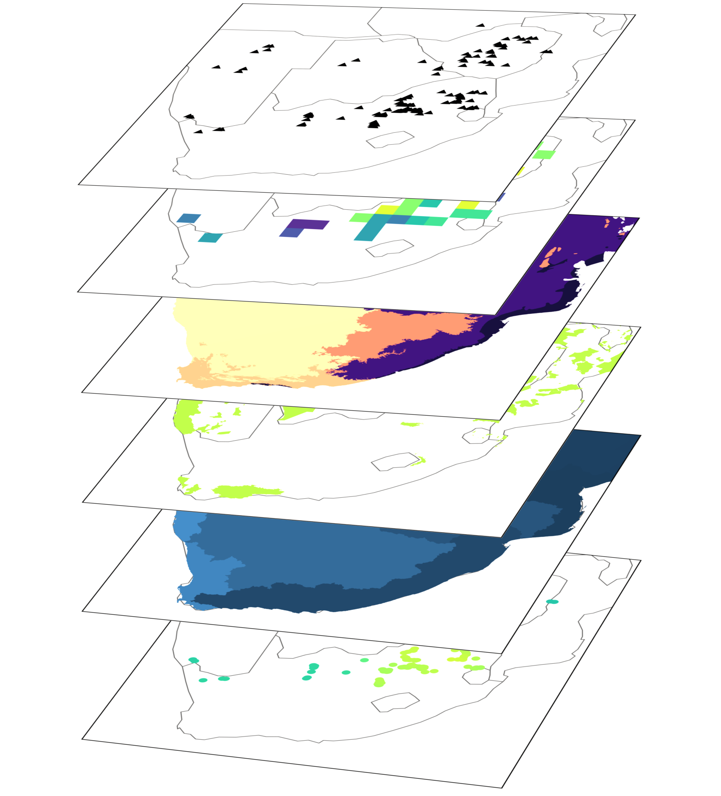
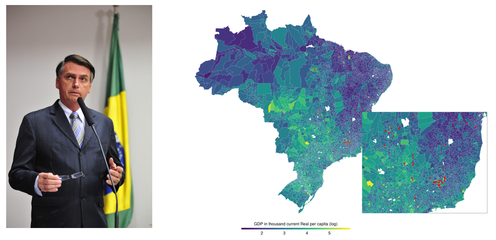

 
```{r setup, include=FALSE}
knitr::opts_chunk$set(echo = FALSE)
```

## Topic of my PhD

> 'Modelling the environmental and socio-economic impacts of global mining activities in a geospatial assessment framework'

<p align="center">
  
</p>

[FINEPRINT](www.fineprint.global) project

## Global mining data


## 3 papers

- **Global mining expansion into vulnerable ecosystems**
  - Mostly descriptive spatial statistics
  - Open tasks: only fine-tuning
  
  

## 3 papers

- **Global mining expansion into vulnerable ecosystems**
  - Mostly descriptive spatial statistics
  - Open tasks: only fine-tuning
- **Mining and tropical deforestation**
  - (together with Nikolas)
  - A lot of data
  - Straight-forward econometric setup
  - Open tasks: visualisation, model comparison

## 3 papers

- **Global mining expansion into vulnerable ecosystems**
  - Mostly descriptive spatial statistics
  - Open tasks: only fine-tuning
- **Mining and tropical deforestation**
  - (together with Nikolas)
  - A lot of data
  - Straight-forward econometric setup
  - Open tasks: visualisation, model comparison
- **Mining and local economic growth**
  - (Bayesian) Spatial econometric growth model
  - Point data (mines) and polygons (socio-economic variables)

## Mining and local economic growth



## Mining and local economic growth

- Lesage and Fischer (2008) suggest a Spatial Durbin Model for growth regressions
  $$y = \rho Wy + X\beta + WX \theta + u$$
- Use, for now, simulated data
- Play around with
  - setting up required functions
  - model selection
  - spatial weights


