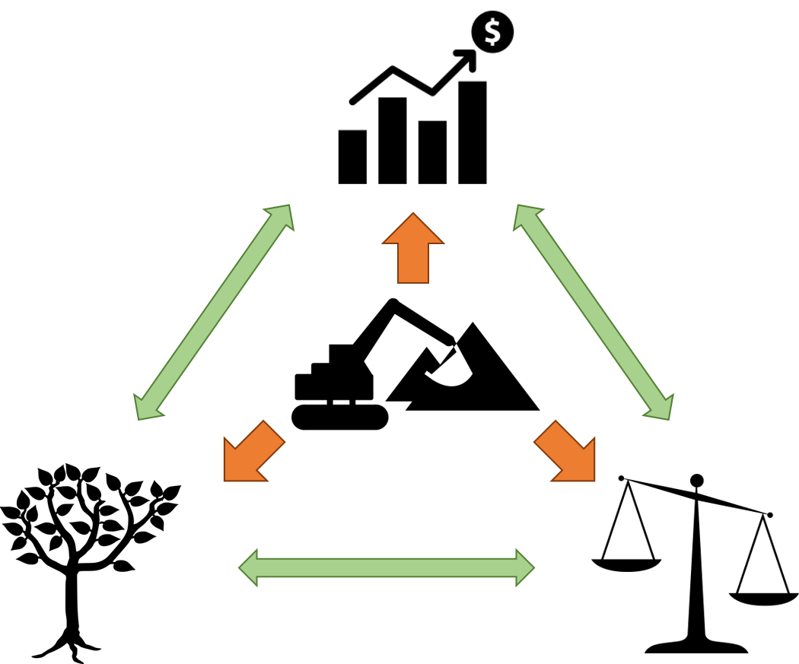
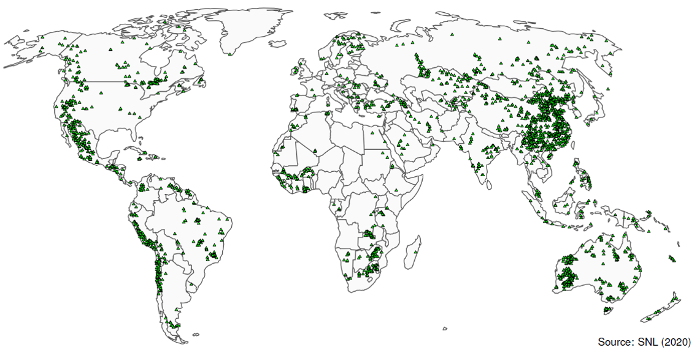

 
```{r setup, include=FALSE}
knitr::opts_chunk$set(echo = FALSE)
```

## Topic of my PhD

> 'Modelling the environmental and socio-economic impacts of global mining activities in a geospatial assessment framework'

<p align="center">
  
</p>

[FINEPRINT](https://www.fineprint.global) project

## Global mining data

<p align="center">

</p>

## Paper idea: mining and local economic growth

<p align="center">

</p>

## Theory is ambiguous
- Mining clusters `r emo::ji("slightly_smiling_face")` or mining enclaves `r emo::ji("unamused")`? (Arias 2014)
- Empirically unchecked claims that mining would in general foster regional development.

Research question: **Do these claims hold?**

## Empirical framework

<p align="center">

</p>

## Empirical framework {.smaller}

- Point data (mines) and polygons (socio-economic variables)
- (Bayesian) Spatial econometric growth model
  - Built upon standard growth regressions, convergence across countries (e.g.  Barro 1991)
  - Extended by mining data
- Lesage and Fischer (2008) suggest a Spatial Durbin Model for growth regressions
$$y = \rho Wy + X\beta + WX \theta + u$$
  - $y$ denotes the $n \times 1$ vector of regional economic growth rates, $n$ being the total number of regions
  - $X$ is an $n \times k$ matrix of $k$ exogenous regional characteristics in the initial period
  - $W$ is an $n \times n$, non-negative, row-standardised spatial weights matrix with zero main diagonal
  - $k \times 1$ vectors $\beta$ and $\theta$ correspond to $X$ and $WX$ respectively
  - $\rho \in (-1, 1)$
  
## Project feasibility

- Use simulated data!
- Play around with
  - Setting up required functions
  - Model comparison
  - Spatial weights
  
## Simulating the data

- Exhibit spatial dependence in y and X

Figure of g and X1

- Mines are posititively/not at all/negatively related to municpal GDP

## Issues
- Real data is messy
  - Political borders change over time
  - Availability of control variables
- Mines are point data and information on extraction volumes is patchy
  - Treating presence of mining as binary vs. using extraction volumes

## Thank you!

Contact me: sebastian.luckeneder@wu.ac.at

&nbsp;
&nbsp;
&nbsp;
<center>
[www.fineprint.global](https://www.fineprint.global)

[github.com/fineprint-global](https://www.github.com/fineprint-global)

[researchgate.net/project/FINEPRINT](https://www.researchgate.net/project/FINEPRINT)
</center>

&nbsp;
&nbsp;
&nbsp;

<p align="center">

</p>


